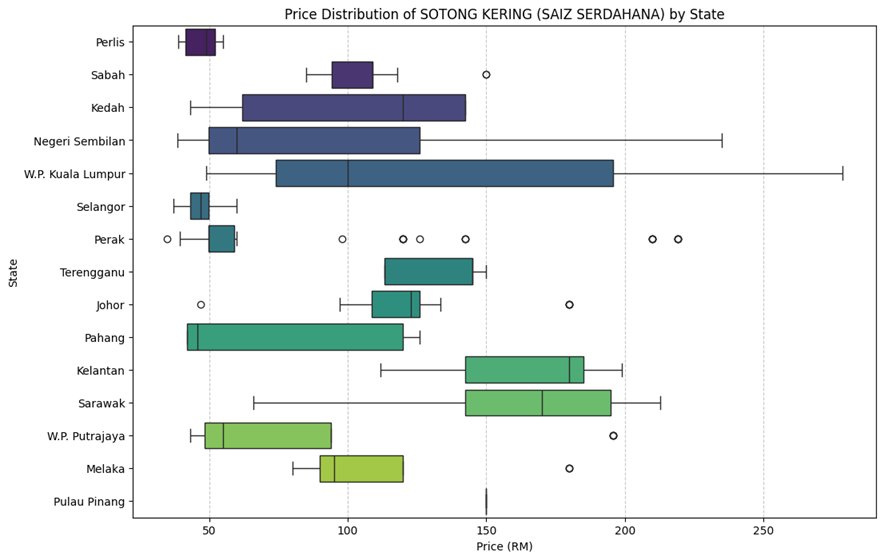
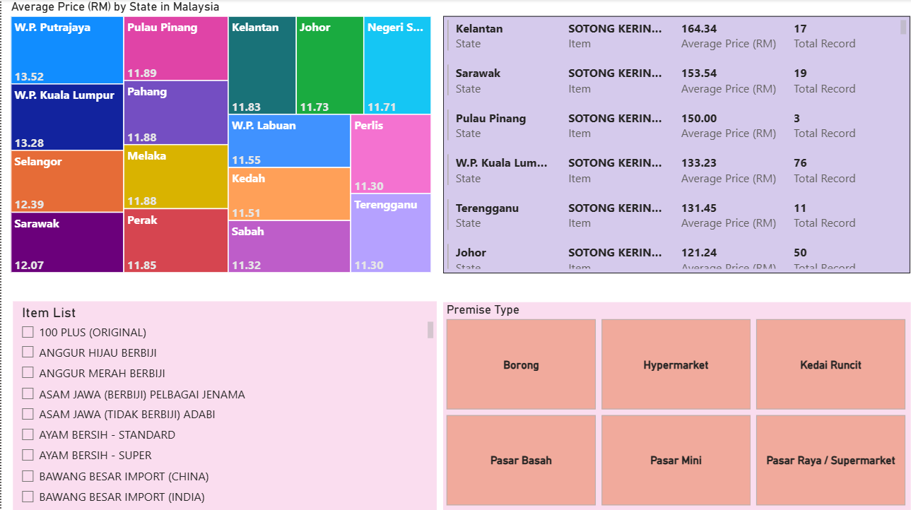
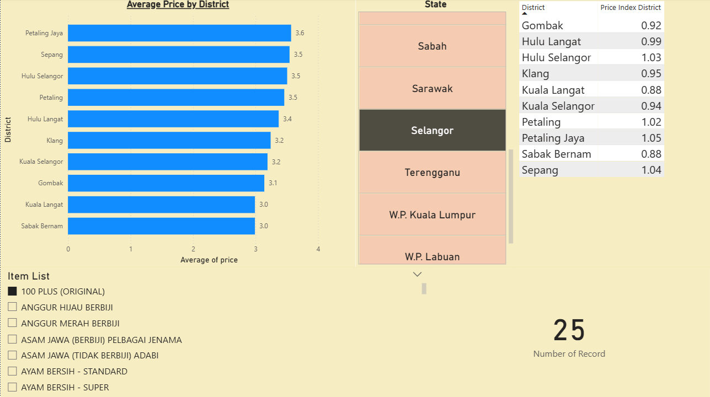
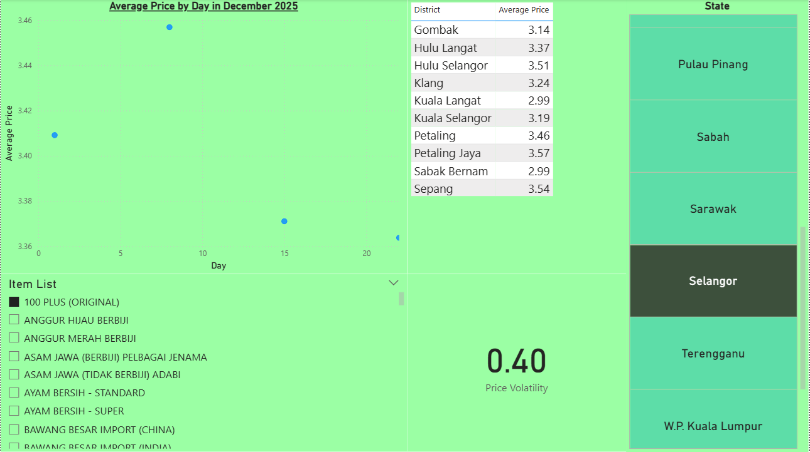

# 🇲🇾 Malaysia Retail Price Intelligence Dashboard
**A full-stack data analysis project using SQL, Python, and Power BI.**

## 📌 Project Overview
This project focuses on identifying price disparities and inflation trends for essential goods across Malaysia. Using real-world data from OpenDOSM's "PriceCatcher" dataset, I developed an end-to-end pipeline to transform over 1 million rows of raw transactional data into actionable business insights.

## 🛠️ Tech Stack
- **SQL (PostgreSQL):** Data cleaning, DDL/DML, and View creation.
- **Python (Pandas, Seaborn):** Exploratory Data Analysis (EDA), outlier detection, and distribution analysis.
- **Power BI:** Interactive dashboarding, DAX (Price Indexing & Inflation measures).

## 🚀 The Data Journey

### 1. Data Engineering (SQL)
- Imported raw CSV data into a PostgreSQL database.
- Performed data quality audits to identify and remove `NULL` values and "sentinel" values (-1).
- Carried out preliminary analysis to 'feel' the data.
- Created a `master_price_catcher` VIEW to join premises, items, and price data for analysis.

### 2. Statistical Deep-Dive (Python)
- **Insight:** Identified a **Bimodal Price Distribution** for specific goods (e.g., Sotong Kering). 
- **Finding:** In Kuala Lumpur, prices are split between two distinct market segments: Budget (Wet Markets) and Premium (Hypermarkets in districts like Bukit Bintang).
- **Visualization:** Used `FacetGrid` KDE plots and Boxplots to compare price volatility between major states.

### 3. Business Intelligence (Power BI)
- Built a dynamic dashboard to track **Intra-Month Price Averages**.
- Developed a **District Price Index** measure to benchmark local prices against the state average.
- Visualisations and cards that highlight price movement and volatility across the districts or items.

## 📊 Key Insights
* **Geographic Disparity:** Sarawak exhibits higher price floors and volatility compared to Selangor, for some items, likely due to supply chain fragmentation.
* **District Benchmarking:** Districts like **Bukit Bintang** and **Lembah Pantai** operate at a higher price premium compared to suburban KL districts like **Bandar Tun Razak** for some items.
* **Market Segmentation:** Modern retail chains drive the "premium" price peak, while traditional markets maintain the "budget" floor.

## 🔗 Link & Sources
- https://open.dosm.gov.my/data-catalogue/pricecatcher
(Price Catcher Data Taken from December 2025 Version)
- https://data.gov.my/data-catalogue/lookup_premise
- https://data.gov.my/data-catalogue/lookup_item

## 📂 Repository Structure
- `SQL_Scripts/`: SQL queries for database setup and cleaning.
- `Python_Notebooks/`: Jupyter Notebook containing Python EDA and visualizations.
- `Dashboard/`: Power BI (.pbix) file and screenshots.
- `.env`: Template for local database connection settings (Removed to ensure privacy).
